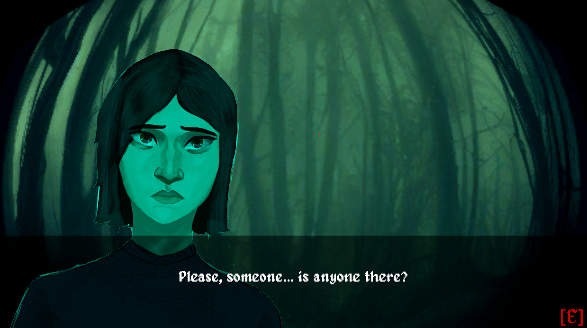

#  TikTik

**TikTik** is a top-down horror RPG set in a world gripped by an eternal eclipse. As mysterious transformations turn ordinary people into terrifying “aswangs,” you must survive the night, make critical decisions, and uncover the truth behind the darkness.

---
##  The Team!
- Samuel Cezar - Lead Developer
- Reiven Lee - Co Developer
- Samantha Caoile - Artist

> This project is a student-led indie Horror Game created as part of our requirement for the CGAE203, 2D Game Development Class.
> Do note that this repository contains all the Unity Files. If you want to experience the game itself, you'll have to build it first.

### 📜 Game Plot

An eternal eclipse has enveloped the Earth. In the chaos, some humans have turned into **aswangs**—supernatural creatures from Philippine folklore. Their origins are unknown, and they hide among the remaining survivors.

Each night, you must choose whether to **accept** or **reject** those seeking shelter. Using clues broadcast over a **radio**, you'll interrogate guests, detect lies, and manage limited energy to make life-or-death decisions.

Your ultimate goal? **Protect the innocent. Banish the wicked. Survive five harrowing nights.**

---

## 🕹️ Game Type

- **Genre:** Top-Down Horror RPG  
- **Perspective:** 2D Top-Down  
- **Gameplay Style:** Narrative-driven, deduction-based survival

---

## 🔧 Core Gameplay Mechanics

### 🧍 Accepting or Rejecting Guests
- Interact with strangers knocking at your door.
- Choose whether to **accept** or **reject** them based on dialogue and subtle behavioral cues.

### 📻 Radio Clues
- Each night, a radio provides cryptic updates on the **aswangs’ traits**.
- Use this intel to identify impostors.

### ❓ Interrogation
- Ask targeted questions to guests.
- Compare responses to radio clues to detect inconsistencies.

### ⚡ Energy Management
- Each question consumes **energy**.
- Plan interactions carefully—overextending may leave you vulnerable.

---

## 🎯 Goals and Objectives

- ✅ **Accept All Possible Guests:** Shelter as many true survivors as you can.
- 🔪 **Identify All Aswangs:** Do not let any aswangs into your house! Yer gut feeling is your ally.
- 🌘 **Survive Until Night 5:** Balance trust, fear, and energy management to live through the nightmare.

---

## 🧰 Assets List

### 👤 Character Assets
- **Main Player**
- **Guests 1–12**

### 🏚️ Environment Assets
- **Room** (Safehouse interior)
- **Door** (Main point of interaction)
- **Radio** (Primary clue provider)

---

## Acknowledgement:
Authors:
		- bluecarrot16
		- JaidynReiman
		- Benjamin K. Smith (BenCreating)
		- Evert
		- Eliza Wyatt (ElizaWy)
		- TheraHedwig
		- MuffinElZangano
		- Durrani
		- Johannes Sjölund (wulax)
		- Stephen Challener (Redshrike)

